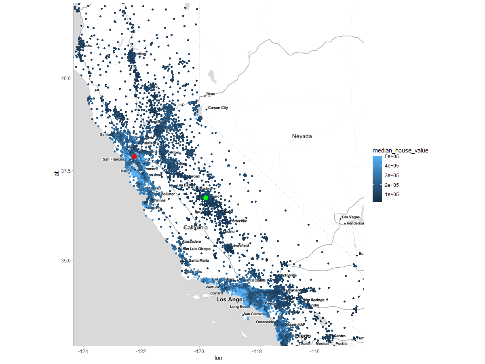
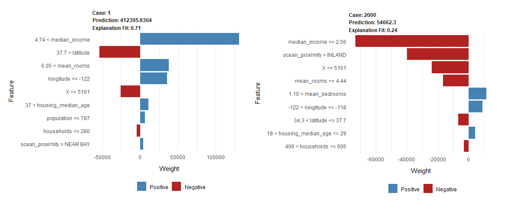

##  How the price of the house is influenced by neighborhood? XAI methods for interpretation the black box model

*Authors: Klaudia Gruszkowska, Bartosz Jamroży, Bartosz Rożek (Warsaw University of Technology)*

### Abstract

### Introduction

Being able to predict the potential price of a house is crucial for the real estate market. Therefore, over the years, many papers have been focused on improving prediction methods [@2-2-housingprediction-ml1; @2-2-housingprediction-ml2]. The main question regarding forecasts is what data influences the price. In addition to physical factors of the house, such as size, number of rooms, the condition of the building, the price is also influenced by the area in which the house is located. The neighborhood affects the price of the house and the house affects the value of the surrounding buildings. Thus, house price prediction models based on neighborhood data were created [@2-2-neighborhood1; @2-2-neighborhood2; @2-2-neighborhood3].

With the development of artificial intelligence and machine learning, the use of this type of algorithm is gaining popularity in the field of forecasting house prices [@2-2-housingprediction-ml1]. Black-box models is an important part of machine learning. However, unlike glass-box models, they do not have a clear, human-readable way of determining predictions [@EMA]. So why do we use them when we have glass-box models at our disposal? The complexity  of black-box models is both an advantage and disadvantage at the same time. Due to it, we get better, more tailored predictions, but we also doom ourselves to the lack of precise information on how the given result was obtained.

Using algorithms, we would like to know what influenced the prediction result and how. We are not inclined to trust such a difficult and complicated activity to algorithms whose decisions are unclear to human. Therefore, in this paper we use Explainable Artificial Intelligence (XAI) methods to analyze the output of the  black-box model. 


### Literature


### Local explanations

We used observation 1 and 2000, because they are far from each other in the set so that they have different value.

```{r 2-2-local-map,out.width="1000", fig.align="center", echo=FALSE, fig.cap='Choosen observations presented on a map. Red point - observation 1, green point - observation 2000'}

```

#### Break Down

#### Lime

**Intuition**

Local Interpretable Model-agnostic Explanations (LIME) was firstly proposed by Ribeiro, Singh, and Guestrin [@lime].

In LIME decomposition, our goal is to create an approximate glass-box model for a given observation. That model would be fully human-readable and can be easier analized. To do so, we create an artificial data set and teach the chosen glass-box model on it. The coefficients on the variables for the created model are the coefficients on the validity of the variables for our observation.

**Results**

Figure \@ref(fig:2-2-lime) shows the result of using LIME method [@lime] from DALEX [@dalex] package. Common for both observations is that the `median_income` variable has the largest effect on prediction. However, the impact in the case 1 is large positive but in the case 2000 it is large negative. It is caused by the value of the variable. It is worth noting that the variables longitude and latitude have opposite signs in both cases. This is because these variables are negatively correlated \@ref(fig:????). The second most valuable variable is the map location variable. 

```{r 2-2-lime, out.width="1000", fig.align="center", echo=FALSE, fig.cap='Lime decomposition  (L) observation 1, (R) observation 2000'}

```

It follows that for the observations, the key variables are `median_income` and some kind of location. Additionally, plots show us that impact of `population`,`households` or `housing_median_age` is not significant.


#### Ceteris Paribus

#### Local explanations conclusions


### Global explanations

#### Feature Importance

#### PDP

#### Global explanations conclusions


### Conclusion


